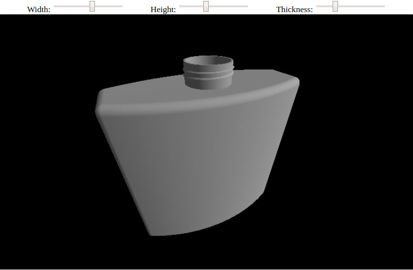

<p align="center">
  

  <h3 align="center">OpenCascade.js Examples</h3>

  <p align="center">
    This is a repository with examples for <a href="https://github.com/donalffons/opencascade.js">OpenCascade.js</>
    <br />
    <br />
    <a href="https://donalffons.github.io/opencascade.js-examples/index.html">Live Preview</a>
    ·
    <a href="https://stackblitz.com/github/donalffons/opencascade.js-examples/tree/master?file=README.md">Start coding on Stackblitz</a>
  </p>
</p>

(These instructions are for the upcoming `@beta` release.)

# OpenCascade.js Examples

This is a repository with examples for [OpenCascade.js](https://github.com/donalffons/opencascade.js). Currently, it contains:
* The [Bottle Tutorial](https://old.opencascade.com/doc/occt-7.4.0/overview/html/occt__tutorial.html) from the official OpenCascade Documentation
* A loader for STEP / IGES files, which uses Emscripten's `FS` object in JavaScript to simulate a file system

# Live Preview

A live preview of this project lives [here](https://donalffons.github.io/opencascade.js-examples/index.html).
You can also use [CodeSandbox](https://codesandbox.io/s/github/donalffons/opencascade.js-examples?file=/README.md) to start experimenting with the code from your browser.

# How to run this example locally

1. Install the dependencies

    ```sh
    yarn # with yarn
    npm i # with npm
    ```

2. Start the example

    ```sh
    yarn start # with yarn
    npm start # with npm
    ```

    A new browser window will open which runs the bottle example.

    
